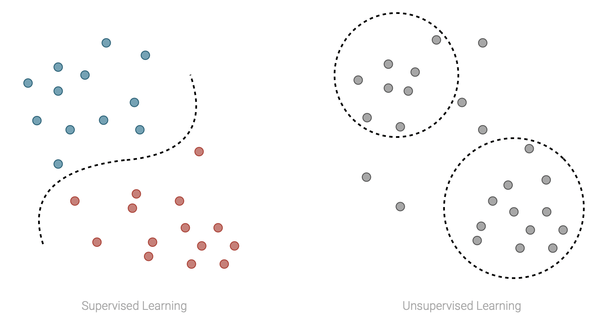
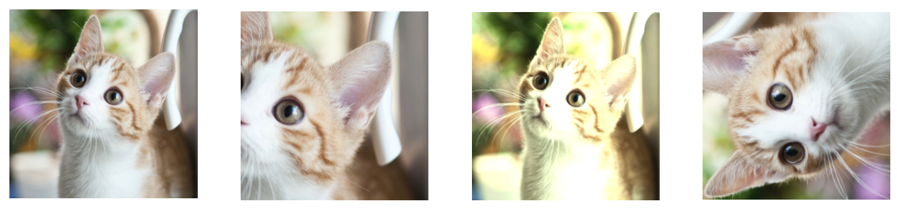

# Contrastive learning - SiDNN 2022

## Structure of the presentation

| **Section**                                                                           | **Topics**                                                                                                                            |
|:-------------------------------------------------------------------------------------:|:-------------------------------------------------------------------------------------------------------------------------------------:|
| [Introduction](#introduction)                                                         | Learning approaches (supervised, unsupervised, self-supervised), definition of Contrastive Learning, general intuition and motivation |
| [Application examples in CV](#contrastive-learning-in-computer-vision)                | CL in practice: a brief introduction of  CL in Computer Vision and an overview over a influential application (SimCLR)                |
| [Theoretical understanding of CL](#theoretical-understanding-of-contrastive-learning) | Explaining CL: InfoMax principle and Alignment and Uniformity                                                                         |
| Applications in NLP                                                                   | Brief contextualization of Contrastive Learning in Natural Language Processing, overview of two applications (SimCSE and DPR)         |

## Introduction

#### Supervised and Unsupervised Learning

As you might already know, machine learning approaches are traditionally divided in two main categories: **supervised** and **unsupervised** **learning** (for simplicity we're not considering other important frameworks such that reinforcement learning and semi-supervised learning, which are less relevant in this context). 

In supervised learning the data consists of a collection of training samples. Each sample consists of one or more inputs and an output, and the goal of the model is to learn a mapping between inputs and output. Tasks that can be tackled using this approach are for example classification and regression. 

On the other hand, in unsupervised learning the data always consists of a collection of training samples, but in this case for each sample we only have the inputs and no longer the outputs. In this case, the goal of the model is to learn structures in the data, an some tasks that can be tackled using this approach are for example clustering and density estimation. 

The main advantage of supervised approaches is that can be very effective with the right amount of label data. This is also its main weakness, since labeled data are usually expensive and hard to be scaled up. On the other hand, unsupervised approaches can leverage huge quantity of data, but their exprexiveness is limited. 

However, there exists a middleground between the two, that combines the advanteges of the approaches presented so far: self-supervised learning. 

#### Self-supervised Learning

**Self-supervised learning** is a particular approach that allows to exploit "natural" labels that come for free with data in certain contexts, without the need of any external annotator, to learn representations for the samples. 

In self-supervised the model is trained on an unlabeled dataset (usually large) using a supervised training task (also called *auxiliary task*). This task is often simple and not very relevant *per se*, but allows us to learn very good representations for the input data, that can be then used in other tasks (usually supervised tasks). The use of these pre-trained embeddings can lead to a strong increase in the performances on the downstream tasks.

#### Contrastive Learning

**Contrastive Learning** is one of the most popular and powerful approaches used within the self-supervised framework. Being a self-supervised approach, its primarly goal is to learn meaningful representations leveraging huge datasets and a supervised training objective. 

The rational behind contrastive learning is fairly reasonable: we want to learn embeddings such that in the latent space of representations "similar" pairs are close to each others, while all the others are pushed away. But how we define pairs? In the *unsupervised setting* (yes, of course there is also a *supervised setting*, and we will dive more deep into it later on) pairs are simply augmentations of the same input sample. 

The intuition behind this objective is that we want our encoder to learn to extract as much shared information between similar pairs as possible, which ideally corresponds to the semantic information that underlies each augmented sample, and at the same time remain invariant to noise factors, that are not very relevant for the semantic meaning of the sample and that are simulated by the augmentations. One example in the context of image embedding is presented below: we want to learn a generic embedding for this cat, that is invariant to "noise factors" such that the camera position and the colors of the image, for example.

But does this very intuitive framework work in practice? Well, it seems so! Below for example are shown the accuracies achieved in the ImageNet Linear Benchmark in the last few years (accuracy on a classification downstream task; the task consists of training a self-supervised learning to extract image embeddings, then freezing the embeddings and adding a linear classifier on top of them, and finally measure the accuracy of the method). The picture clearly show how the advent of contrastive learning approces translated in a huge increase of performances in this task.

## Contrastive Learning in Computer Vision

In this section, we will take a brief look at applications of contrastive learning to the Computer Vision field. The choice of this field followed a simple criteria: examples are rather easy to visualize. In particular, the goal of this section is not to cover exaustively the state of the art in the field, but rather to provide a strenghten the intuition and the general understanding of the principles that lead contrastive approaches.

Contrastive Learning approaches for self-supervised learning originated in Computer Vision. One of the first contrastive framework (as reported by Chen et al. 2020) was proposed 30 years ago by Becker & Hinton and consisted of multiple neural networks trained on different portion of the input stereograms using a pseudo-contrastive objective (trying to obtain similar latent embeddings among the different networks).

Why contrastive methods originated and florished so much in this field? The answer it's rather simple: it's really easy to augment samples without affecting their intrinsic semantic meaning! There is a wide pool of augmentation techniques available, that span from color modification (random color distorsion, Gaussian blurring, etc.) to image modifications (random cropping, resizing, rotating, etc.).

Even if the first contribution to contrastive learning has now more than thirty years, these methods really started trending and achieving state-of-the-art perfomances in the last five years (primarly because of the development of new, more performing hardware). Many relevant works were presented in the last few years (this is not at all a comprehensive list):

- MoCo (He et al. 2019)

- **SimCLR** (Chen et al. 2020)

- BYOL (Grill et al. 2020)

- Barlow Twins (Zbontar et al. 2021)

#### SimCLR

SimCLR is a simple framework for contrastive learning of visual representations. It was proposed by Chen et al. in 2020 and it's one of the most influential works in the contexts of contrastive learning in Computer Vision. 

The core idea behind SimCLR is rather easy: use parallel stochastic augmentation to produce positive pairs. Then, the model is trained to maximize the similarity between positive pairs, while minimizing the similarity with all the other embeddings. 

A visual representation of the pipeline is shown below. Note that the similarity between positive pairs is not computed directly on the latent-space embeddings *h*, but rather on a non-linear projection *z* which is obtained passing the latent embeddings through a 1 hidden layer perceptron. The authors in fact show in their paper that this improve the quality of the representations in downstream tasks before the projection layer *g( )*, and they conjecture that this is due to the excessive loss of information induced by the contrastive loss (e.g. in some tasks informations about the color might be useful). The non-linear projection on the other hand can learn to be invariant to this kind of information, allowing to preserve them in the previous layer.

The training of this models is articulated in 4 different steps.

1. randomly sample a mini-batch of *N* images, augment them to obtain *2N* samples in total

2. given one positive pair (defined by the couple of augmentations obtained from the same original image) the othe *2(N-1)* are considered as negatives; all the samples are passed through the encoder *f( )*

3. for each embedding *h = f(x_i)*, a non linear projection *z = g(h)* is computed

4. compute the loss for the mini-batch using cosine similarity as similarity function
   
   $$
   \ell_{i,j} = -\,log\, \frac{\exp(sim(z_i,z_j)\,/\,\tau)}{\sum_{k=1}^{2N}{1}_{[k\neq i]}\exp(sim(z_i,z_k)\,/\,\tau)}
   $$

The authors investigate in their work many aspects related to the proposed model and discover many interesting insights about the framework and constrastive learning in general. However, for the sake of conciseness, we will cover just the most interesting that are related to the more broad contrastive setting.

- contrastive learning benefits more from stronger data augmentation than supervised learning

- composition of multiple data augmentation operations is necessary to yield good embeddings

- contrastive learning benefits from larger batch sizes and longer trainings (more negative samples)

These findings are rather interesting, as they allow us to identify in negative samples and powerful data augmentation one of the reasons why the framework works so well in practice and does not overfit the data also if trained for longer compared to supervised approaches.

---

## Theoretical Understanding of Contrastive Learning

Enough intuition! It's now time to dive a little more into the teoretical understanding of this particular learning approach. In the last few years, many efforts went into a more formal mathematical explanation of the good results achieved by this particular learning approach.

First of all, it's important to formally define a general and unified training objective. In this work, we will adopt the general contrastive loss notation for tranining an encoder $f : R^n \rightarrow \mathcal{S}^{m-1}$ mapping data to $\ell_2$ normalized feature vectors of dimension *m* defined by (Wang and Isola, 2020). Let

- $p_{data}$ be a distribution over the input space

- $p_{pos}$ be a distribution over positive pairs

- $\tau$ a scalar temperature parameter 

- $M \in \mathbb{Z}_+$ a fixed number of negative samples

Then, the contrastive loss can be defined as 

$$
\mathcal{L}_{contrastive}\,(f; \tau, M) = \underset{\substack{(x,y)\sim p_{pos}\\ \{x_i^- \}_{i=1}^M \stackrel{\text{i.i.d.}}{\sim} p_{data}}}{\mathbb{E}} \left[ -\, \log\, \frac{\exp\left(f(x)^\intercal f(y)/\tau\right)}{\exp\left(f(x)^\intercal f(y)/\tau\right) + \sum_i \exp \left( \,f(x_i^-)^\intercal f(y)/\tau \right) }\right]
$$

#### InfoMax principle

Many initial works on contrastive learning were motivated by the so called **InfoMax principle**, that is the maximization of the mutual information between the embeddings of positive pairs $I(f(x);f(y))$. In this setting, the contrastive loss is usually seen as a lower bound on the mutual information.

For example, (Tian et al. 2019) in their work derive the theoretical bound

$$
I(z_i;z_j) \ge \log(k) - \mathcal{L}_{contrastive}
$$

However, this bound, as well as the InfoMax interpretation in general, has been proved to be quite weak, both from a theoretical (McAllester & Statos 2020, which in their work showed formal limitations on the measurement of mutual information) and empirical (Tschannen et al. 2019, which showed that optimizing a tighter bound on mutual information can lead to worse representations) perspective.

#### Alignment and Uniformity

A more recent work from Tongzhou Wang and Phillip Isola backed contrastive learning with a new theoretical explanation. In their work, the two authors identify two novel properties and use them to explain the origin of good performances of this framework. These two properties are **alignment** and **uniformity**.

The first one, alignment, is rather straightforward and is derived directly by the initial intuition behind contrastive learning. It quantifies the noise-invariance property, and is defined as the expected distance between positive pairs. 

$$
\mathcal{L}_{align}(f;\alpha) = \underset{(x,y)\sim p_{pos}}{\mathbb{E}} \left[ ||f(x)-f(y)||_2^\alpha\right], \qquad \alpha > 0
$$

Referring to the initial graphic about embeddings in the latent space, the alignment property quantify "how close are pulled embeddings of similar representations in average".

Uniformity, on the other hand, measures how uniformly distributed are the feature vectors in the latent space. We want features to be uniformly distributed to preserve as much information of the data as possible. 

Uniformity is less straightforward to define, as it need both asyntoptically correct (must converge to the uniform distribution in the limit of infinite samples) and empirically reasonable with a finite number of data points. These properties are matched by the Radial Function (RBF) kernel, employed by the authors to finally define the uniformity loss as the logarithm of the average pairwise RBF kernel.

$$
\mathcal{L}_{uniform}(f; t) = log \, \underset{(x,y)\stackrel{\text{i.i.d.}}{\sim} p_{data}}{\mathbb{E}} \left[ \exp\left( -t\,||f(x)-f(y)||_2^2 \right)  \right], \qquad t > 0
$$

Uniformity in the hypersphere is rather difficult to visualize, but we can try using an illustration inspired from (Wang and Isola, 2020). 

## References

- Lilian Weng's blog ([link](lilianweng.github.io/))

- Yonglong Tian, Contrastive Learning: A General Self-supervised Learning Approach ([link](https://www.youtube.com/watch?v=7YBwnc9D2d4))

- Suzanna Becker and Geoffrey E. Hinton, [Self-organizing neural network that discovers surfaces in random-dot stereograms](https://doi.org/10.1038/355161a0), 1992

- Ting Chen, Simon Kornblith, Mohammad Norouzi and Geoffrey Hinton, [A Simple Framework for Contrastive Learning of Visual Representations](https://doi.org/10.48550/arXiv.2002.05709), 2020

- Tongzhou Wang and Phillip Isola, [Understanding Contrastive Representation Learning through Alignment and Uniformity on the Hypersphere](https://arxiv.org/abs/2005.10242), 2020

- Michael Tschannen, Josip Djolonga, Paul K. Rubenstein, Sylvain Gelly and Mario Lucic, [On Mutual Information Maximization for Representation Learning](https://doi.org/10.48550/arXiv.1907.13625), 2020

- David McAllester, Karl Stratos, [Formal Limitations on the Measurement of Mutual Information](https://doi.org/10.48550/arXiv.1811.04251), 2018

- Yonglong Tian, Dilip Krishnan and Phillip Isola, [Contrastive Multiview Coding](https://doi.org/10.48550/arXiv.1906.05849), 2019

- 
